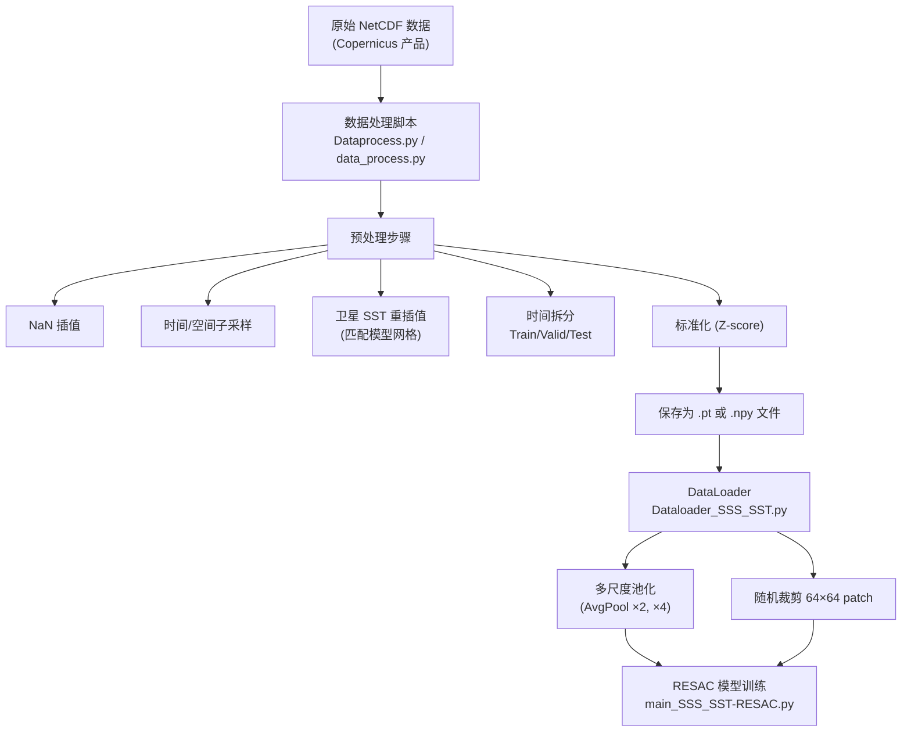
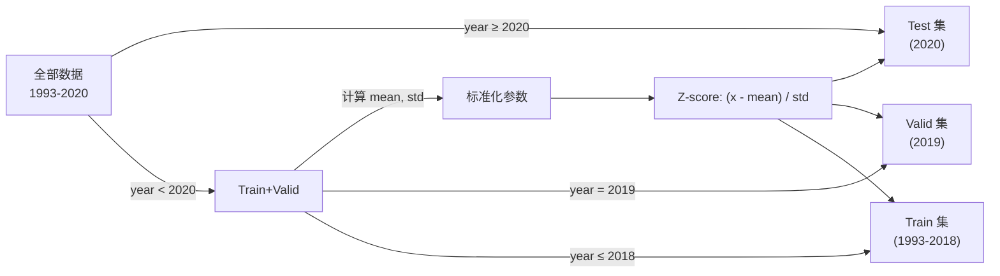
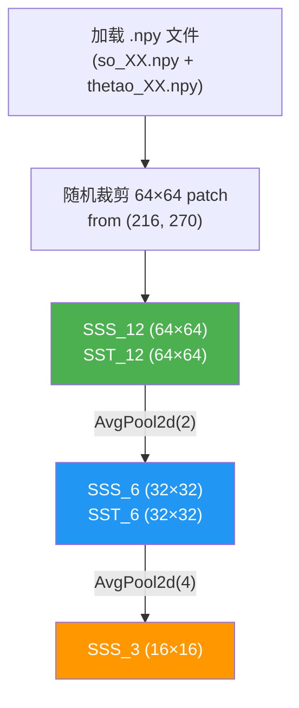
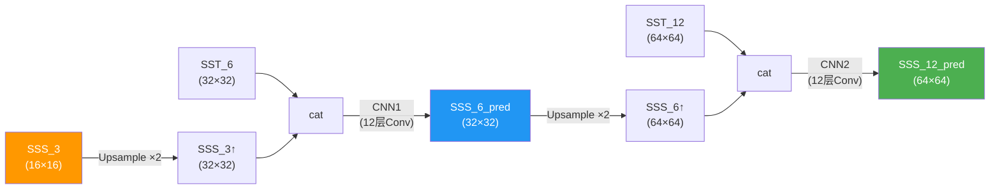

# 数据处理流程分析 — StageTH 项目

## 项目概览

本项目实现了海洋物理变量的**超分辨率 (Super-Resolution / Downscaling)**，使用 RESAC 模型将低分辨率的海洋数据提升到高分辨率。核心思路是利用高分辨率的辅助变量（如 SST）来引导低分辨率目标变量（如 SSS/SSH）的空间分辨率提升。

数据来源于 **Copernicus** 海洋数据产品，覆盖马尾藻海区域 (LON -64 ~ -42, LAT +26 ~ +44)，时间范围 **1993–2020**。

---

## 整体流程图

---

## 第一阶段 — 原始数据

### 数据源

| 产品 | 变量 | 分辨率 | 说明 |
|------|------|--------|------|
| **GLORYS12V1** (001_030) | `sla` (SSH), `uo` (U 速度), `vo` (V 速度), [so](file:///f:/StageTH/Code/Dataprocess.py#111-116) (盐度), `thetao` (温度), `zos` (海面高度) | 1/12° | 模型再分析数据 |
| **SST_PRODUCT** (010_024) | `analysed_sst` | 1/20° | 卫星观测 SST |

> [!NOTE]
> 模型网格大小为 **216 × 270** (纬度 × 经度)，约 10,227 个时间步 (1993–2020 每日)。

---

## 第二阶段 — 数据处理脚本

项目包含 **两个版本** 的数据处理脚本：

### 1. [data_process.py](file:///f:/StageTH/Code/data_process.py) — 原始版本 (Maximilian)

简化版脚本，对每个变量独立处理，保存为 `.pt` 文件。处理步骤：
1. 读取 NetCDF → 转换为 PyTorch Tensor (`torch.float32`)
2. 添加通道维度 (`unsqueeze(1)`) → shape: [(T, 1, H, W)](file:///f:/StageTH/Code/RESAC_train/archi_SSS_SST.py#64-116)
3. SST 需要双三次插值到模型网格大小 [(216, 270)](file:///f:/StageTH/Code/RESAC_train/archi_SSS_SST.py#64-116)
4. 按年份拆分 Train/Test（2020 年为 Test）
5. 计算 Train 集的 mean/std → Z-score 标准化
6. 进一步拆分 Train → Train (–2018) + Valid (2019)
7. 垂直翻转 (`torch.flip([2])`) 后保存

### 2. [Dataprocess.py](file:///f:/StageTH/Code/Dataprocess.py) — 改进版本 (C. Mejia, V.2)

更完整的版本，增加了：
- **NaN 线性插值** ([interp_nan_from_ds](file:///f:/StageTH/Code/Dataprocess.py#310-387))：逐像素检测并修复孤立的 NaN 值
- **子区域选择**：可选 128×128 或 96×96 的子区域
- **时间子采样**：可每 N 步取一个时间步
- **xarray 原生拆分**：使用 `ds.loc[dict(time=slice(...))]` 按年份切片
- **维度信息保存**：使用 pickle 保存坐标/维度元数据
- **SST 重插值**：使用 xarray 的 [interp()](file:///f:/StageTH/Code/Dataprocess.py#310-387) 将卫星 SST 网格重新插值到模型网格

---

## 第三阶段 — 数据拆分与标准化

对**每个变量**，流程相同：

**标准化细节：**
- Mean 和 Std 基于 **Train+Valid 集** 的所有像素和所有时间步计算
- Test 集使用相同的 mean/std 进行标准化
- 保存为 `mean_std_*.npy` 或 `mean_std_*.pt`

---

## 第四阶段 — 文件保存格式

### 当前项目使用的格式 (.npy)

`Code/data/Copernicus_processed_data/` 目录下包含 **5 个变量**：

| 前缀 | 变量 | 文件数 |
|------|------|--------|
| `so_` | 盐度 (Salinity) | 38 train + val + test |
| `thetao_` | 温度 (Temperature) | 38 train + val + test |
| `uo_` | 东向流速 (U) | 38 train + val + test |
| `vo_` | 北向流速 (V) | 38 train + val + test |
| `zos_` | 海面高度 (SSH) | 38 train + val + test |

- **Train 文件**：`{var}_{nn:02d}.npy`（如 `so_00.npy` ~ `so_37.npy`），每个文件包含 256 个时间步
- **Valid 文件**：`{var}_val.npy`（整年数据）
- **Test 文件**：`{var}_test.npy`（整年数据）
- 每个文件 shape: `(N, 1, 216, 270)` → 约 33 MB / 文件

---

## 第五阶段 — DataLoader 与多尺度生成

[Dataloader_SSS_SST.py](file:///f:/StageTH/Code/RESAC_train/Dataloader_SSS_SST.py) 中的 `Dataset_rsc` 类负责在训练时加载数据并生成多尺度输入：

**关键参数：**
- 裁剪位置随机：`r1, r2 ∈ [0, 60)`，保证 64×64 patch 在 216×270 范围内
- 返回5个 tensor：`(sss_3, sss_6, sss_12, sst_6, sst_12)`

---

## 第六阶段 — RESAC 模型与训练

[archi_SSS_SST.py](file:///f:/StageTH/Code/RESAC_train/archi_SSS_SST.py) 中的 `resac_v2` 模型实现两级超分辨率：

**训练配置** ([main_SSS_SST-RESAC.py](file:///f:/StageTH/Code/RESAC_train/main_SSS_SST-RESAC.py))：
- 优化器：AdamW (lr=1e-3, weight_decay=0.01)
- 损失函数：RMSE (两级输出的 RMSE 之和)
- 调度器：ReduceLROnPlateau
- Batch size：64
- Epochs：20
- 实验跟踪：Weights & Biases (wandb)

---

## 总结

| 阶段 | 文件 | 输入 | 输出 |
|------|------|------|------|
| 数据处理 | `Dataprocess.py` | NetCDF (Copernicus) | 标准化的 `.pt` / `.npy` 文件 |
| 数据加载 | `Dataloader_SSS_SST.py` | `.npy` 文件 | 多尺度 tensor (3/6/12) |
| 模型训练 | `main_SSS_SST-RESAC.py` + `archi_SSS_SST.py` | 多尺度 tensor | 超分辨率预测 |
